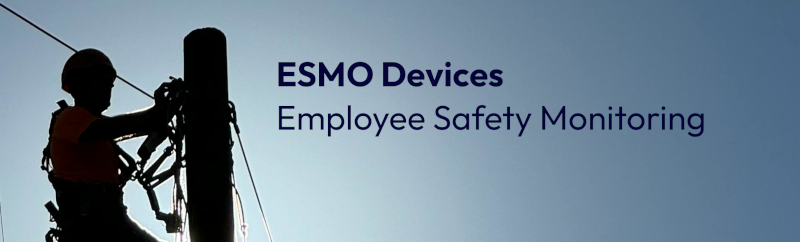

## Simply Connected. Securely Protected

{ width=100%}

### Protecting Companies' Most Valuable Asset: Its People.

# ESMo: Employee Safety Monitoring Devices
Our safety wearables are industry specific devices that give essential workeres the ability to quickyl and easily request emergency assistance, monitor and warn of potential hazards like live voltage, and monitor for falls and other biometric indicators that a worker is in danger. 

## Privacy + Connectivity
ESMo Devices are designed to keep employees safe while respecting their privacy. On-device algorhythms monitor the employees safety, saving battery usage while preserving user privacy. When connectivity is necessary, ESMo devices are designed to connect to networks even when access to traditional cellular networks are not available. 